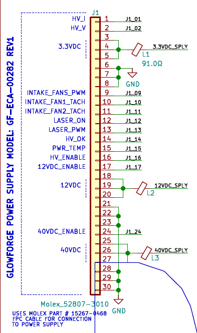
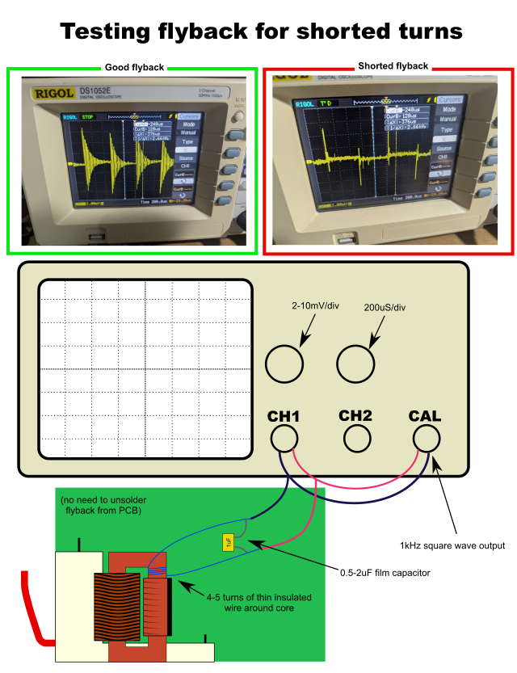

# Documenting the Glowforge Power Supply

This repository aims to contain a collection of information on the
power supply within the Glowforge Pro.

These power supplies frequently fail, and there is little documentation
that can assist when trying to repair them.

[Scott Wiederhold](https://community.openglow.org/u/scottw514/summary) has
done a remarkable job at trying to reverse engineer the GF in order to
produce an Open Source replacement controller and his
[OpenGlow forum](http://community.openglow.org/) contains a lot of
photos, teardowns and information.

I have been trying to repair a broken power supply myself, and wanted
to combine a bunch of information from various posts, as well as what
myself and others found.

> [!TIP]
> Please contribute here if you can. Any additional or improved
> information will be greatly appreciated by many.

> [!CAUTION]
> This information involves working with lethal voltages (400-22,000 volts)
> and high power laser radiation!
> It is intended only for people who are sufficiently experienced in
> working with high voltage electronics and understand the necessary
> precautions.

> [!WARNING]
> The information contained here is provided on a "best effort" basis
> and is not guaranteed to be accurate. Consider this information to
> be a starting point where you should then use your best judgement
> and double checks before relying on anything.

## References

Some links to relevant information, mostly on OpenGlow:

 * [Teardown of power components](https://community.openglow.org/t/reverse-engineering-pr0n/242/2)
 * [High voltage troubleshooting](https://community.openglow.org/t/laser-not-firing/680/2)
 * [Testing HV output](https://community.openglow.org/t/gf-not-fire-working-process/847/2)
 * [Analysis/photos of GF boards](https://community.openglow.org/t/list-of-ics-on-the-control-board/988)
 * [OpenGlow schematic](https://community.openglow.org/t/openglow-prototype-2-schematics/255)

## Extracting the supply

The power supply is quite difficult to get out, as it wedged into a tight
corner and attached using cables with very little slack.

Ken S has made [two](https://www.youtube.com/watch?v=dVIbavUEy1M)
[videos](https://www.youtube.com/watch?v=0B0-IHG0M_s) of the removal
process which is very involved and will probably take an hour.
At one point the machine is flipped upside down - take great care
to ensure the gantry is secure as you dont want it crashing to
one side during the flip.

## Basic information.

A lot of basic teardown information can be found in
[this post](https://community.openglow.org/t/reverse-engineering-pr0n/242)
from Scott.

The power supply is a custom unit which provides several voltages
required by the machine:

 * 3.3v for logic and control board.
 * 12v for various accessories (pump, fans, motors, etc)
 * 40v for higher power components (more fans, peltier perhaps?)
 * 12-22kV for the laser tube.

It also has some control signals which communicate over the ribbon
cable. The 12v, 40v, and HV outputs are only enabled when the right
control signals are set.

It's possible to control the PSU when outside the machine, per
[this post](https://community.openglow.org/t/gf-not-fire-working-process/847/2)

## Opening the PSU

Remove the screws attaching the top lid (where the ribbon cable and HV red
wire are).

Remove the panel on the side by undoing the 4 screws holding it on.

In that panel you can access two cable bundles between the top and bottom
boards. Unplug these from the bottom board.

Remove the top cover and attached board. Take care with the red and white
wires. The red HV wire has a grommet that splits apart when the cable tie
is removed.

The top board is screwed into the lid with 8 Phillips head screws. You will
need to use a driver with a thin shaft to remove the center one as there
is not much space. Be careful not to damage or crack the core of the
flyback transformer.

## Connectors

These are the connectors on the PSU. You could create extension cables in order
to run the machine with the PSU outside of it for testing.

__Molex mini-fit jr 6-way__ is the large 6-pin connector to the daughterboard [Digikey link](https://www.digikey.com/en/products/detail/molex/0766500076/2115933)
  
__TE Connectivity Economy 2.5 4 way__ is the smaller one next to it [Digikey link](https://www.digikey.com/en/products/detail/te-connectivity-amp-connectors/1744417-4/4730270) [mating connector](https://www.digikey.com/en/products/detail/te-connectivity-amp-connectors/1969588-4/5021426)

__Molex 30-way 1mm ribbon cable__ note top on on side bottom on the other [Digikey link](https://www.digikey.com/en/products/detail/molex/0152670468/4427333)

This is the pinout of the ribbon cable:

## Common failure modes

### Red wire

The long red wire carries the high voltage to the laser tube. This
is a common cause of laser failures, with the insulation failing
and the power arcing through to the gantry earth.

There is loads of information online, just search for "glowforge red wire".

### Flyback transformer failure

The high voltage transformer can fail. It seems a common failure mode is
for the components in the potted section to burn out. The currently only
know fix for this is to replace the transformer from a donor unit (the
transformer is a custom unit and cannot be purchased separately).

It *might* be possible to repair the failed parts, but it is risky and
would require cutting the parts out of the potting , replacing them,
and re-potting it. A vacuum chamber would be needed at minimum to
remove air bubbles which would otherwise enable arc-over internally.

### HV supervisor failure

[TODO]

### Low voltage failures

[TODO]

## HV circuit description

TODO: Describe HV principle, operation and parts.

The driver daughterboard has some reverse engineering attempts
documented [here](hv-supervisor/)

## HV circuit troubleshooting

## Testing the supply

### Powerup testing

Using an appropriate dummy load and sending the right control signals,
the various outputs on the supply can be enabled for testing.

Scott has [a post](https://community.openglow.org/t/gf-not-fire-working-process/847/2)
covering this procedure.

Setting the various signals on the ribbon cable can be tricky. I designed a
breakout board which brings these connections into a regular header socket,
and also acts as a passthrough to the control board for verify operation
when installed.

Designs and Gerbers are [available here](breakout-pcb/).

### Flyback ring test

The secondary windings on the flyback can become shorted. This will result
in no or very weak output to the tube, and potential failure of the output
Mosfets.

It's possible to test for such a short with a ring test. A ring test works
by applying a weak square wave to a resonant circuit around the flyback core.
On a good flyback, the circuit will "ring" and oscillate with a gradual
dampening. If there is a shorted turn, this will absorb all the energy
and the ring will diminish rapidly, much like a ringing bell being touched.

This test can be easily done using just a scope, a capacitor (~0.5-2uF), and
a length of thin wire. It's not necessary to remove the flyback from the
PCB.

The diagram below shows the testing setup. It consists of:

 * A scope with a signal output, 1kHz at 1 volt (often the "cal" output)
 * A capacitor (non-polarised, ideally film) of between 0.5 and 2uF
 * 4-5 turns of insulated wire around the core. Thin, as there's not much space.
 * Connect it all in parallel - the flyback does not need to be removed from the PCB
 * Set the scope timebase to 200uS/div, and the vertical to around 2-10mV/div

A flyback with no shorted turns will look something like the left picture,
whereas if it looks more like the right picture, its almost certainly got
shorted turns and the flyback will need replacing.

TODO: Add info on extending cables outside the GF machine.

