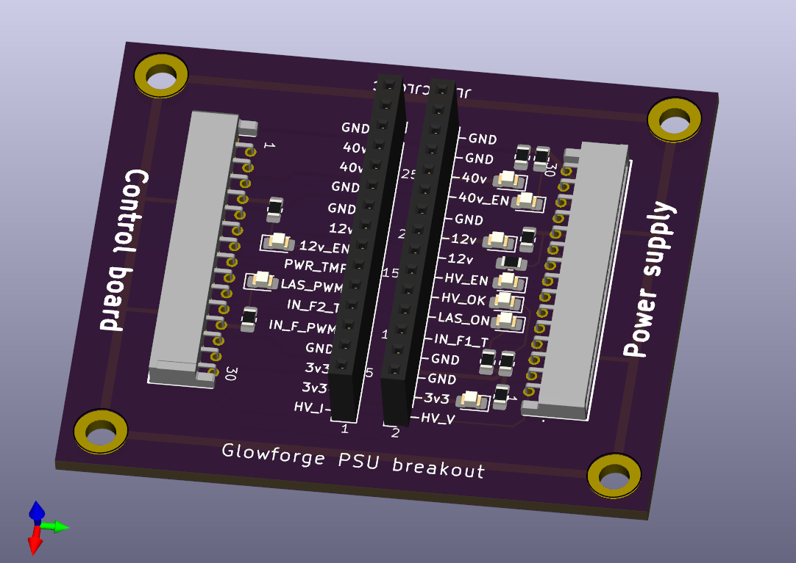

# Breakout board for Glowforge power supply

A board to assist with testing and troubleshooting of a Glowforge
Pro power supply.

Features:

- All 30 pins have passthrough and breakout to 0.1" headers.
- Can be used one-sided for testing standalone
- Can be used inline to monitor a connected supply.
- LEDs to monitor some signals

The gerbers.zip file can be uploaded to most board houses directly for
ordering. e.g for [JLCPCB](http://jlcpcb.com) upload to the 'Instant Quote'
form on their homepage, you can select the default options, order, and
have 5 boards delivered for around $USD5.

The boards will require the following additional parts:

 - 2 x Molex 52807-3010 connectors
 - 2 x 15-pin standard header sockets
 - 0805 SMD resistors
 - 0805 SMD LEDs

You may also need ribbon cable(s). The short one works to connect to this
breakout, but if you need a longer one or want to extend, you need
one with the following specs:

 - FPC cable
 - 1mm pitch
 - 30 way
 - OEM is Molex 15167 series

Note that they come in two flavours - either contacts on the same side at
both ends, or one end at the top and the other at the bottom. Between the
supply and control board as included it has the alternating one -- the
contacts on the PSU are on the bottom of the ribbon, and the contacts on
the control board are the top of the ribbon.

[Digikey link to original 50mm length](https://www.digikey.com.au/en/products/detail/molex/0151670467/3281720)

If you use this breakout as a passthrough, you will want
the variant with contacts on the same side to go to the control board.
[Digikey link to 100mm length](https://www.digikey.com.au/en/products/detail/molex/0151670471/3281724)

Longer lengths should work and means you may be able to run the machine
with the supply outside it.

