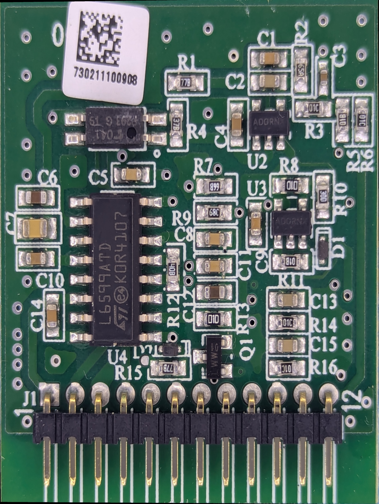

# HV supervisor board

This contains a work-in-progress reverse-engineered schematic of the HV supervisor
daughterboard. This is shown in
[this post](https://community.openglow.org/t/reverse-engineering-pr0n/242/2).

The SOT23-5 chips are likely opamps or comparators, possibly LMC7101 or TLV7211. This is
based upon their likely function and likely pinouts. The markings don't show up on
any known database.

The main chip, an [LT6599ATD](https://www.st.com/resource/en/datasheet/l6599.pdf)
is a fairly common switchmode controller. A detailed
[reference design](https://www.mouser.com/catalog/specsheets/eval6599-90w.pdf?srsltid=AfmBOopz7krkCxWkZxH1WWs20OLARHynyoRecZKV39cnS1sxenkA6IhJ) is also available.

The optocoupler is likely a [TLP293](https://toshiba.semicon-storage.com/info/TLP293_datasheet_en_20191129.pdf?did=14419&prodName=TLP293).

## Pinout

This has been reverse engineered from information such as the schematic (below),
the L6599AT datasheet, 30-pin ribbon cable pinout, and various measurements.

|   Pin  |    Name    |      Description    |
|--------|------------|---------------------|
|   1    |    OUT     | This connects to the half-bridge leg, linking the two driver MOSFETs |
|   2    |    HVG     | The gate drive for the high side MOSFET of the half-bridge |
|   3    |    GND     | Ground |
|   4    |    VCC     | +12V supply for this board. |
|   5    |    LVG     | The gate drive for the low side MOSFET of the half-bridge |
|   6    |  LASER_ON  | Links to `LASER_ON` on the 30-pin ribbon. The last signal for enabling the HV |
|   7    |    HV_OK   | Goes low if the HV driver chip shuts off the HV. Connects to PFC_STOP of the L6599AT |
|   8    |    DIS     | Connects to the DIS pin of the L6599AT. Disables the chip if it is set high |
|   9    |    I_SEN   | Primary current sense, connects to the main sense resistors on the MOSFET low side. |
|   10   | LASER_PWM  | Links to `LASER_PWM` on the 30-pin ribbon. Used to PWM the laser for lower power cuts |
|   11   |    LINE    | Connects to LINE on the LA6599AT. Used for brownout detection, this senses the 60v rail is ok via a divider |
|   12   |    HV_I    | Tube current detection. Connects to a current sense on the HV return |

Typical signals that would be expected on these pins (also educated guesses):

|   Pin  |   Signal    |
|--------|------------------|
|    1   | ~60vDC oscillating, as this carries the primary voltage between the MOSFETs |
|    2   | 12V square wave ~30KHz to drive the high side mosfet gate. |
|    3   | 0v ground |
|    4   | 12VDC as this is a stable supply voltage for this board. |
|    5   | 12V square wave ~30KHz to drive the low side mosfet gate |
|    6   | 3.3v should be applied here to turn on the HV output. |
|    7   | This should be around 1.8v (pulled high) if the chip is running |
|    8   | Should be 0v. At around 1.75v it will shutdown the chip |
|    9   | Will track the MOSFET current through the sense resistors. From 0.8v it will reduce drive, and shut off completely at 1.5v |
|   10   | PWM signal (at 3.3v) to modulate the output. Can be a DC signal for full power. 0v will disable the HV |
|   11   | Detects under and overvolt of the supply voltage. The L6599AT will shutoff with undervoltage if this is < 1.24v, and overvoltage shutoff if > 6v. This is connected via a divider to the +60v rail, also seems to be linked to `LASER_ON` on the main board. |
|   12   | Value range is unknown, but likely is proportional to the tube current measured on the HV return. Connects to an optocoupler on the STBY line of the L6599AT in similar fashion to the datasheet description, typically to regulate the output |

## Testing

The board should be independently testable, as all of the functions are
now known. Testing involves setting some voltages on various pins and
monitoring on a scope for the gate drive signals.

**The below connections may cause a failure of the driver as the correct
wiring for pin 1 is not yet known (leaving the chip OUT pin unconnected
might be problematic).** Verification TBD

|   Pin  | What to connect/measure.
|--------|------------------|
|    1   |  |
|    2   | Should be a ~30KHz square wave |
|    3   | Connect to ground |
|    4   | Connect to +12VDC |
|    5   | Should be a ~30KHz square wave out of phase with pin 2 |
|    6   | Connect this to a 3.3v source, enables the driver |
|    7   | Leave floating |
|    8   | Connect to ground. |
|    9   | Connect to ground. |
|   10   | Connect to 3.3v, PWM input |
|   11   | Connect to 3.3v to keep the brown out detector happy |
|   12   | Leave floating |

## Schematic

[This](glowforge-psu-hvbrd.pdf) has been reverse engineered from photos and measurements of the board. It's drawn in
Kicad and all files are here.

